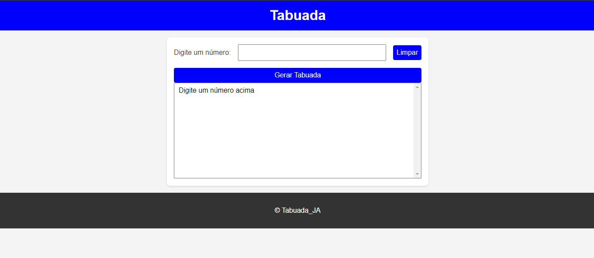
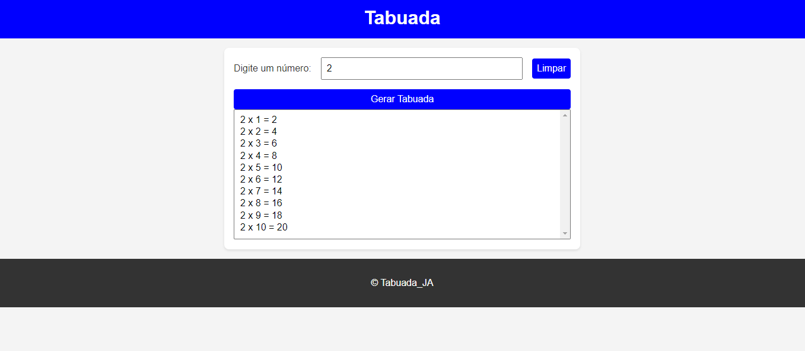

# Tabuada

Este projeto gera a tabuada de um número especificado pelo usuário.

## Descrição

A aplicação permite que o usuário insira um número e, ao clicar no botão "Gerar Tabuada", exibe a tabuada desse número de 1 a 10. Também há um botão "Limpar" para reiniciar a entrada.

## Tecnologias Utilizadas

- HTML5
- CSS3
- JavaScript

## Instalação

1. Clone o repositório:
    ```sh
    git clone https://github.com/josealexandre87/tabuada.git
    ```
2. Navegue até o diretório do projeto:
    ```sh
    cd tabuada
    ```
3. Abra o arquivo `index.html` no seu navegador preferido.

## Uso

1. Insira um número no campo de entrada.
2. Clique no botão "Gerar Tabuada".
3. A tabuada será exibida na lista abaixo.
4. Clique no botão "Limpar" para reiniciar a entrada.

## Capturas de Tela




## Licença

Este projeto está licenciado sob a Licença MIT. Veja o arquivo [LICENSE](LICENSE) para mais detalhes.